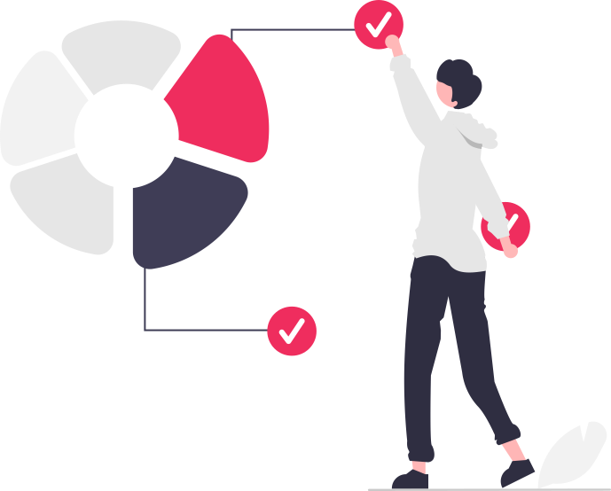

<h1 align="center">Hey , I'm 
    <a href="https://patel-jay.netlify.app" target="_blank" style="color:#EF2D5E">
        Jay Patel 
    </a>
</h1>

  	

<!-- 
 
	 

 -->

	<b>🌟 Unfold My Jorney 🌟 </b>

## ℹ️ About Me

 
	
<b>👱‍♂️ Intro</b>

	 
	

		
		

			
🏫 &nbsp;Pursuing my BE In Information Technology From GTU.

			
💙 &nbsp;I'm an Enthusiastic, Self-Motivated, Reliable, Responsible & Hard Working Person.

			
✨ &nbsp;I use a creative approach to solve the problem

			
📘 &nbsp;Always Motivated to go to Gym to stay Fit & Healthy.

			
🥇 &nbsp;while ( ! ( succeed = try ( ) ) ) ;

			
🎮 &nbsp;Like to Play Video Games in My Free Time.

		

	

 

 
	
<b>💻 Experience </b>

	 
	

		
		

			<!-- 
🏢 &nbsp;Full Stack Web Developer At <a href="https://www.infopercept.com">Infopercept Consulting</a> &nbsp;&nbsp;<i>(Apr 2021 - Present)</i>
 -->
			
🏢 &nbsp;Backend Developer Intern At <a href="https://akashtechnolabs.com/">Akash Technolabs</a> &nbsp;&nbsp;<i>(Jun 2022 - Jul 2022)</i>

			
🏢 &nbsp;ReactJS Developer Intern At <a href="http://www.techelecon.com/">Tech Elecon</a> &nbsp;&nbsp;<i>(Jan 2023 - Apr 2023)</i>

		

	

 

 
	
<b>⚡ Current State </b>

	 
	

		
		

			
📗 &nbsp;I am Currently Learning Next.js

			
🚧 &nbsp;I am Currently Working on <a href="https://patel-jay.netlify.app">Portfolio Website</a>.

			
💬 &nbsp;Feel free to Reach out to me for any Tech Related Stuffs.

		

	

	

 

## 🛠️ My Skills

 
	
<b>👉 Frontend Development</b>

	 
	

		
		
		
		
	

 

 
	
<b>👉 Programming languages</b>

	 
	
 
		
		
		
		
	

 

 
	
<b>👉 Frameworks</b>

	 
	
 
		
		
		
		
		
		
		
		
		
		
		
	

 

 
	
<b>👉 Databases & Cloud Hosting</b>

	 
	
 
		
		
		
		
		
		
		
	

 

 
	
<b>👉 Tools</b>

	 
	
 
		
		
		
		
	

 

## 📊 Stats

 
	
<b>💻 GitHub Profile Stats</b>

	 
	

		

		

		

	

 

	
<b>⚡ Recent GitHub Activity</b>

	 
	
	 

 

## 🔗 Let's Connect

    
    
    
    
    
    
    
    

<b>Though you have came this far, Checkout my Repos ⬇️ & give it a Star ⭐ or Fork it</b>

<!-- [Jay_Patel](https://github.com/jaypatel31/jaypatel31/blob/master/bottom_header.svg) -->
 
 
